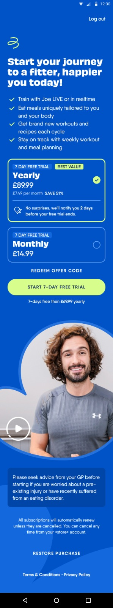
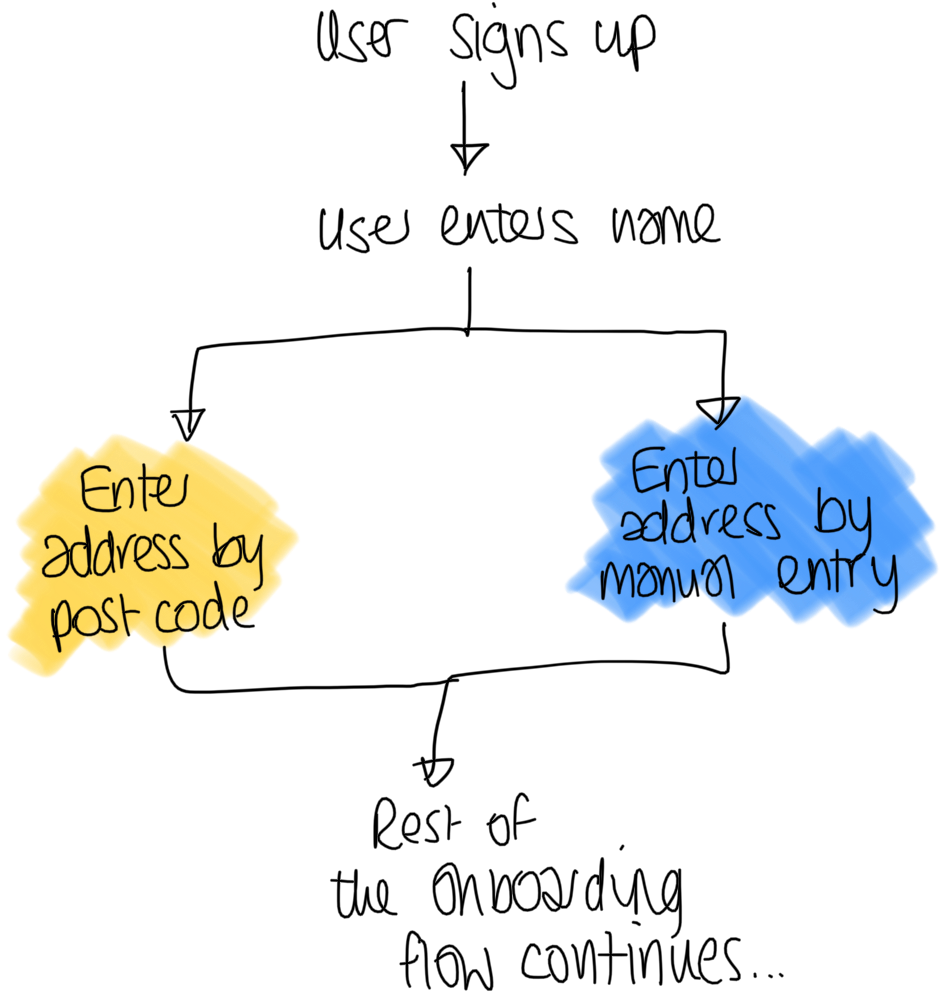
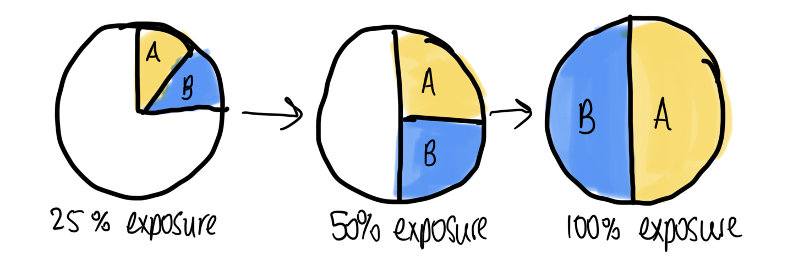
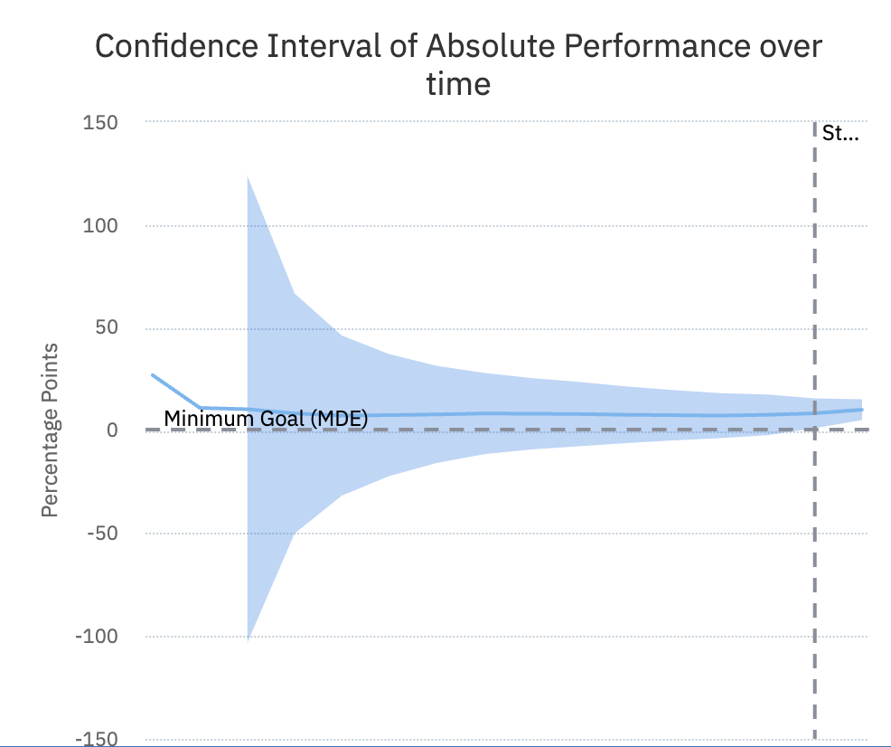
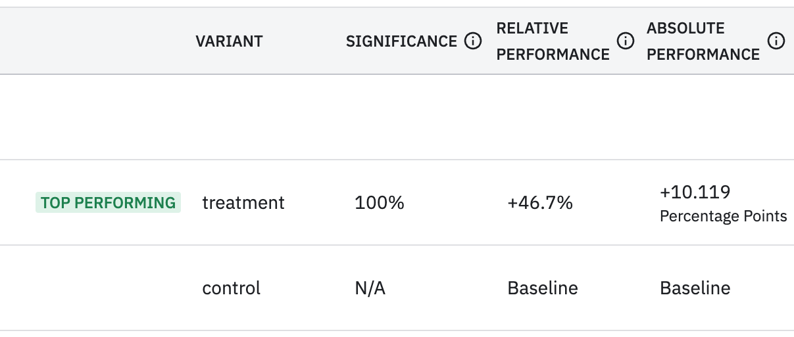

As part of the Get Moving team at The Body Coach, we set up and ran an A/B test to attempt to improve the conversion of users on our paywall. A/B tests are hard to run well and this one was one I felt ran well – we got great results from it.

Here’s what we did, and how it all came about.

## Identifying the problem space

The product and design teams at The Body Coach did research which uncovered that our paywall – where we asked the user to pay to sign up – wasn't following best practise.

After a lot of research by the team, in particular from the website [Superwall](https://www.paywallscreens.com/), they came up with optimisations and a new design which we ran as our A/B test. Here are the old and new designs side-by-side:

| Before                                           | After                                         |
|--------------------------------------------------|-----------------------------------------------|
|  |  |

## Fundamentals of an A/B test

For those new to A/B testing, this is where you show two sets of users two different variations of the app.

In the example above, one variant (in yellow) allows a user to enter their address using their postcode. In the second variant (blue) they instead enter their address manually in a form.

This might sound like feature flags and there is a lot of overlap but the key takeaway from an A/B test is that you're actively measuring the effect the variations (or variants) have on user behaviour.

Taking the address entry example above. You may choose to measure how many users finish onboarding. If your new variant has more people completing the onboarding, this would positively affect your customers and revenue. My personal hypothesis here would be users would prefer to enter their address via postcode as it is quicker. 

## Setting up the experiment

The most difficult thing when setting up an A/B test is not the different variants, but what *metric* to measure success against.

If the metric is too loosely related to the user behaviour, you risk the experiment running forever without a conclusion, or an ambiguous result.

For example, if you're changing the onboarding flow a poor metric would be whether the user retains after 30 days. A user will see the onboarding only once, so it is unlikely to play a large part in them sticking around using your app. The proportion of users who complete onboarding is a metric much more likely to be affected by a good (or bad!) change to the onboarding.

### Choosing the metric

For the paywall, the metric we want to measure is clear – how many people go on to pay? We kept this as a secondary metric, but the main metric we measured was *Intent to subscribe*, which is best explained as the question:

> Does the new paywall increase the amount of people who go through to the Apple Pay/Google Pay screens?

We made the choice to make the primary metric an Intent to Subscribe for two reasons. 

The first was technical - a user could take a trial or perform a purchase, so we’d need to measure two metrics in one. This was fiddly so we decided to avoid this metric. We did actually measure it as well, but it was not our primary metric used to determine if the experiment was successful or not.

The second was to reduce the scope of the A/B test. Say we’d done some misconfiguration on the new paywall and it errored when the user tried to subscribe. This would change the experiment results if we were measuring the subscriptions as failed against the new paywall, although this wouldn’t be the fault of the paywall redesign itself. We wanted to limit the number of independent variables in the experiment so we could get the most accurate results, quickly.

## Running the experiment

We used Amplitude to run this A/B test. My candid review of Amplitude is that it is fantastic, but the data is overwhelming. A huge positive of it is that it takes a lot of the interpretation of the data and does it for you, removing human bias in the results. 

Amplitude splits an A/B test into four stages:
- **Plan**: creating the A/B test parameters themselves
- **Configure**: deciding what user segments will see which variant
- **Monitor**: see when users are being exposed to variants in real-time
- **Analyse**: See the statistics and conclusions around your experiment

Our set up for this experiment was simple - any user who would see the paywall would see either the new or old version. We then measured how successful each of these were. We did no user segmentation to present certain types of user the new paywall as we wanted to get the broadest information possible.

As a paywall is a very important part of revenue generation, we wanted to move slowly on this, because any negative result on the new variant would result in revenue loss. So we started with 10% of users in the experiment (half of whom would see the new variant and half the old). Once we saw users were signing up through the new variant we knew it was working and increased the percentage in steps up to 100%. As the experiment had a 50/50 split, this resulted in half the user seeing the new paywall, half the old, and us measuring all of their outcomes.

## The results

Our results started off slow but their statistical significance was low. This made a lot of sense - with only a few users in the experiment initially a lot of the changes could be down to fluke. When increasing the number of users in the experiment the statistical significance of the experience accelerated.

In the end our results really did bear out that many more users would attempt a purchase on the new paywall:

Within a few weeks - just before our busiest period of the year - we decided to switch the whole user base to see the new paywall due to its significant uplift in users attempting to purchase.

## Conclusion

This experiment was a major success. Not because it showed us what we expected, but because we managed to get a highly confident result driven off our hypothesis. Had we got a confident result, but one that showed our old paywall was more performant, then that would still be a highly successful test.
