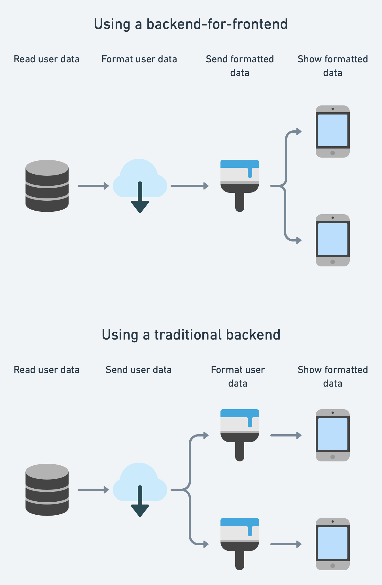

Knowing where to put business logic is in my opinion one of the most important pieces of software development. When I have the choice of placing it in the backend or frontend, here are the decision points I think about.

## What is a backend-for-frontend

Even if you've not come across the term backend-for-frontend (BFF), you may have used one before!

Instead of an API which returns data objects which the app then has to format, a BFF will return the formatted information (that the UI uses directly) with minimal processing in your app code.

Let's look at an example, of UI which shows the user's initials, some tags, and address.

A "standard" backend might return the following JSON:

```json5
{
  user: {
    firstName: "Joe",
    middleNames: null,
    surname: "Bloggs",
    customerNumber: 9909,
    paidSubscriber: true
  },
  address: {
    houseNumber: 10,
    houseName: null,
    street: "Downing St",
    line2: null,
    city: "London",
    county: null,
    postCode: "SW1A 2AA"
  }
}
```

An API response like this will mean we need to have business logic in the app – for example, handling those null values and tying the whole address into a `String` we can show.

In a BFF, the response will have the formatting within it, and would return something like this:

```json5
{
  initials: "JB",
  address: "10 Downing St\nLondon\nSW1A 2AA",
  tags: ["Customer #9909", "Subscriber"]
}
```

The resulting architecture and differences can be summed up like this:



There's a clear difference here, how what are advantages and disadvantages of each approach?

## Advantages of BFFs

### Single algorithm and formatting across products

The best advantage from my perspective is that as the diagram above shows, you've reduced code duplication (and deviation) across multiple platforms.

When working at Freetrade, we had a few bugs around the price quoted when you were purchasing or selling shares, which were hard to fix consistently across the two platforms as the code was so different. We took time to migrate the logic to a backend so that there would never be inconsistencies, and where calculation errors could be fixed in a single  place.

### Bugs can be fixed without releasing new app versions

When you place the formatting in the backend, any bugs uncovered can be fixed on the release cycle of your backend instead of your apps. Given that backends typically have a faster release cycle than apps (as they don't have to go through any review process), this means a faster fix.

### Easier to start a new platform

Spinning up a new platform is much quicker when you have BFFs because there is a whole chunk of code you don't have to write. This allows more experimentation and is useful if you're planning more platforms than you currently have.

### Clearer boundary between data and UI

A difficulty when coming to large data migrations is _knowing_ where data is used. By making your frontends use fewer data models, you can do migrations or restructures in your production database much easier.

This is the same reasoning behind layered architectures and DTOs – but on a larger scale.

## Advantages of frontends

BFFs aren't all roses and there are key things you need to think about when using one.

### No API versioning & management

Changes to UI require more organisation when using BFFs – as you need to produce and format the new data in the backend _before_ attempting to use it in the frontend.

This is the pattern you need to follow:
- Additive changes (only adding new data) can be done with no versioning required
- Mutative changes (changing the format of existing data) can be done, although if you're using the data in a different way, making it an additive change is better (then retire the old data).
- Destructive changes (removing data from the API response) require new API versions to avoid breaking older clients.

It is worth considering that you may end up with a long tail of users on old versions using old APIs – it is good to have a way to manage this.

When the client does formatting/processing, if the data models don't change, there's no versioning required.

### Native formatting behaviour

Android and iOS come with strong native formatting behaviour and you won't be able to use that when using a BFF. Javascript does have its `Intl` API which covers a lot of the API, but things like 12/24 hour preferences would have to be managed manually when using a BFF (for example by a query parameter or header indicating the users preferences).

### More complex/less native localisation

Again, not only do Android and iOS have good formatting but they have simple and well-thought-out localisation. In a BFF you will also have to consider this – there are libraries to use in backends, and the `Accept-Language` header is a common and well-defined pattern.

### Bugs affect all platforms

One of the biggest trade-offs – whilst BFFs allow you to fix bugs across all platforms at once, they allow you to introduce them on every platform at once!

## Questions to help you decide

A vaguely scientific way of deciding whether to use a BFF or not is by answering the following questions:

- Do we have more capability in backend than frontend right now?
- Is keeping Android/iOS/Web in sync a high priority?
- Is complex processing required where bugs need rapid fixes?
- Will we be adding a new platform soon?
- Do we have a good way of versioning our APIs?
- Is this design unlikely to change in the next month?
- Do we have no localisation needs/do we have good backend localisation tools?

The more of these questions you answer yes to, the more tempted I would be to go for a BFF:


## Conclusion

This gives a look at the relative advantages and disadvantages of backends-for-frontends. _Personally_ I feel like they are very useful and try to use them because it means I don't have to write the same business logic for Android _and_ iOS _and_ web.

In a regulated company like Freetrade, being able to release critical bug fixes without an app submission/review/force-update cycle was a huge advantage.

But like all things in tech BFFs are a trade-off, and I hope this explains the thoughts in my mind when building out new features like this!