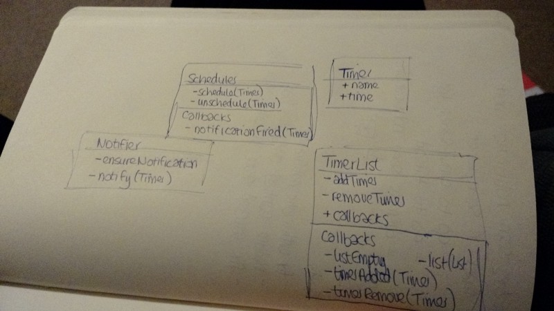

# The Christmas coding conclusion part 1: the web app

I set myself [a target](./christmas-coding-2014.md) to write an Android, iOS, and web app over the Christmas period. Here are my learnings from the first one I produced, which was the web app.

This was my favourite to do simply because it was almost completely new to me. I’d used a little bit of Jasmine before during the iPlayer for Chromecast project, but not much, and had a rudimentary knowledge of web technologies.

I started with a different slice on the web compared to iOS (and indeed, it probably wasn’t a very good first slice), whereby I got adding and removing timers working first, without any _actual_ timers. This was alright but I didn’t build in the UI for deleting timers at the same time, and my first slice should probably have just been additions.

## The Good

One thing I did in the web app which I quite liked was having a callback for the creation of a timer — either it called a success function with the timer created, or a failure function with a human-readable message. This made it easy to validate errors and super easy to show to the user what they’d done wrong.

The domain logic was very separated from the UI logic, which made testing easy (but, ironically, this made it easier to not test the UI!).

## The Bad

One thing I didn’t do, and would liked to have done, is test the UI. I wasn’t entirely sure how to do this (e.g., when a timer is added, the “no timers” label should hide). This is something I will be looking up further.

I also found that scheduling things with `window.setTimeout()` didn’t seem to be very testable, even when using Jasmine’s mock clock. As a result the notification scheduling wasn’t tested (and I didn’t even realise that the timeout was set twice for quite a while!).

## The Ugly

I still don’t like the non-typed aspect of Javascript though, it just gives me the creeps. Furthermore, although I didn’t really investigate it much, I find that the web really needs some sort of Android-esque ListView component. I couldn’t find one, but then I didn’t look too hard.

Also, I noticed that testem is very good but very power-hungry — it’d drain about 5% of my laptop’s battery in about 20 mins of use. Guess it is a tradeoff of power vs. feedback loop time.

It is also a shame that the web Notifications API doesn’t work on mobile browsers.

## Next steps 

Things I’d like to investigate more:

- Using ServiceWorkers, app manifests, and similar techniques to create an offline experience
- Persistence over sessions would be really cool
- Improving/investigating cross-browser compatibility
- A better mobile experience (I’d love a slide-up panel which shows the current timers)

## Useful resources

- A [great article](http://css-tricks.com/snippets/css/a-guide-to-flexbox/) about flex box
- [Can I use](http://caniuse.com/), which details the compatibility matrix of certain HTML5 or CSS attributes

## What I should have done differently

I didn’t do any design really, and let my tests drive my design. I thought this was a mistake at first, as I realised that my design differed on web and iOS, but then realised how I’d only test-driven one of them (for the first part at least). I liked the approach I took on the web, so chose to use that as my “design” and pulled that architecture into iOS and Android.

