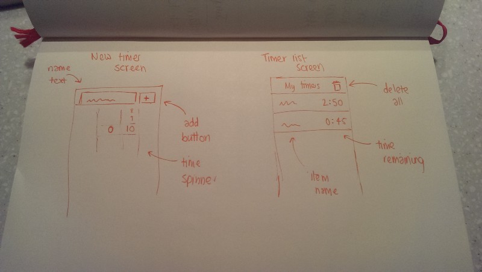

> Want to read the conclusion? Go [here](./christmas-coding-2014-conclusion.md)!

This Christmas, I’ve decided to set myself a coding challenge — develop a simple app across Android, iOS, and the responsive web.

I’m going to be developing a simple cooking timer app which will have the following features:

- Set multiple concurrent timers, for different things you’re cooking.
- Ability to delete timers
- Use native notifications
- It will be test-driven*
- Use of animations

  
Whilst my Android skills are fine (and hence, this will be the one I’ll be doing last), my ObjC and in particular my web skills are lacking. My plan is to start features on the iOS version, translate them to the web version and then finally Android, where I’ll do some experimentation in core/view division.

Why am I doing this? As mentioned above, T-shaped people are what companies like, and, in Agile environments such as at the BBC, being a generalist makes it easier for your team to adapt to change. Not only can you be a generalist outside of your role (e.g. devs helping out test, fleshing out stories with a BA etc), but inside your role; indeed, this is the direction my team is taking — to make all the developers cross-platform.

Being a mobile team means that I’m much better acquainted with iOS and Android that web, and I’m particularly looking forward to tackling that challenge (including testing, which I have little knowledge of). I’m working on iOS first because it is familiar enough to get somewhere, yet I’ll still be learning something.

The apps will be available on Github to check out and use; the iOS one is there [already](https://github.com/amlcurran/Cooking-Timer).

I’ll keep you updated, and why not try setting yourself a coding challenge in between the sprouts?

Now find out what I found out in the conclusion!

*except for the bit of the iOS app I’ve already done!