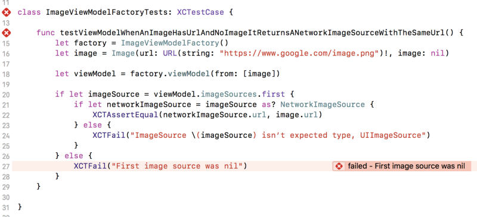

Unit testing is great, isn’t it? Not only can it help you improve your code, but it can ensure that you don’t mess anything up the next time you come to change it. The downside with testing is that it is very easy to write a test that ends up being a nightmare to read! Here, I’ll go over some useful tips which may make it easier to read and reckon with your unit test code.

## Assertions and their use

If you’ve not written a test before, then you may not have seen a typical test assertion. Assertions (like many things in software development!) come in many shapes and sizes, but most of the time they are a piece of code which checks (or asserts) something.

An if statement is actually an assertion, in the example below we’re asserting that the array is not empty:

```
if imagesArray.isEmpty == false {
    // Do something here
}
```

In tests, assertion are the key points of unit tests — we use them to assert (or check) that our logic gives us the expected result:

```
func testTwoMultipliedByTwoIsFour() {
    let calculator = Calculator()
    let result = calculator.multiply(2, by: 2)
    XCTAssertEqual(result, 4)
}
```

In the case above, the line XCTAssertEqual(result, 4) is the assertion — we’re asserting that result is 4.

You can find the full descriptions of each XCTAssert method [here](https://developer.apple.com/documentation/xctest). In this demo below, we can see how our sample test looks when it fails.

You can use XCTFail() to always trigger a failure — this is useful in cases like this where we have an if let that may not pass. An important point is that tests in Xcode pass by default, so we must remember to explicitly fail on branches which count as failures.

However, here the assertion, whilst detailed, takes twice the amount of lines as the rest of the test! Let’s extract a custom assertion to make it more readable.

## Custom assertions

We can write our own custom assertions, which are useful in the case that either the assertion can get complicated, or you end up duplicating assertions across tests, and you practise the [Three Strikes Rule](http://wiki.c2.com/?ThreeStrikesAndYouRefactor).

We can extract the assertion out as method shown below. This makes the assertion smaller in the test method itself, and also gives us a much better idea of what is actually being checked, without having to wade through two if let statements.



Our assertion works as expected now. But curiously, the assertion failure is no longer shown in the test, but in our helper method. This is annoying when running a test, as you have to dig around a little more to find what the error is. This is _really_ annoying when multiple tests use the same assertion, as they all fail the assertion on the same line!

We want to show the failure where we call our custom assertion, but currently the failure is shown where our custom assertion calls XCT functions. Luckily, we can change that.

Some people will prefer to prefix their custom assertion function with XCT to make it “look” like a built-in assertion method, like XCTAssertEquals(_,_). Using another framework’s prefix is generally discouraged, but may help you to find your custom assertion in autocomplete results quicker. Find what works best with your team.

## Changing where an assertion is shown

There is a way we can point the assertion failure to look like it comes from where our custom assertion method is called, rather than from within it.

Each XCT function comes with two handy default parameters — which are used to indicate where to put the red cross in Xcode, and where to show the error message. These are file and line, and there are two corresponding special “macros”*, #file and #line. These macros hold the file name and line number which is captured when they are used. As they are default parameters, they will correspond to the file and line where the XCT function is called, unless they’re overriden.

We can use them in our custom assertion method, and pass them into the XCT functions. Let’s change the signature of our assertion to:

func assertFirstSource(of imageSources: [ImageSource], isNetworkWithURL expectedURL: URL, file: StaticString = #file, line: UInt = #line)
This then captures the line and file our custom assertion was called at (i.e. in our test method at line 21 in the image below), and we can inject these values into the XCT functions, so that any messages they emit will get posted at line 21:


Notice how we now pass file and line to the XCT method calls. Now, we see that our assertion failure is again back within the test (making it more obvious how that test failed), but has the message that was generated from the XCTFail on line 34. Neat! We’ve made file and line default parameters in our assertFirstSource(..) method, so if we had this method wrapped in another custom assertion, we could do the same thing.

## Summing up

Custom assertions are a useful way of making tests easier to read. In order to make them work properly:

- Use file, line and their corresponding macros, #file and #line, to make your test failures appear in the right place.
- Always call an XCT function (XCTAssert or XCTFail) in every branch, else your test may pass when it should fail.
- Give your assertions the clearest error messages you can, so it is obvious why something failed.

Thanks for reading! Follow me to keep hearing more about clean coding and improving your Swift 😇.

The code for this blog post can be found on my [Github](https://github.com/amlcurran/Blog-Post-Demos/blob/master/Blog%20Post%20DemosTests/ImageViewModelFactoryTests.swift).

