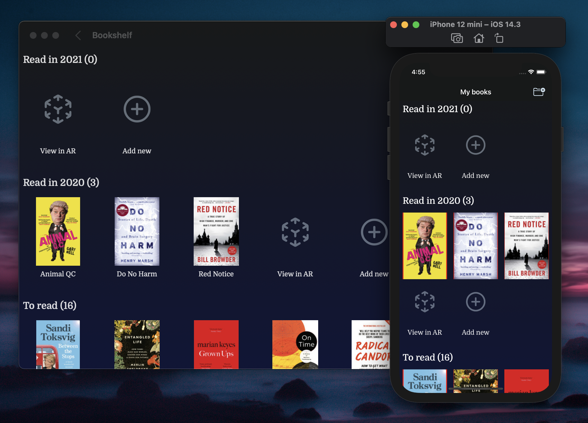
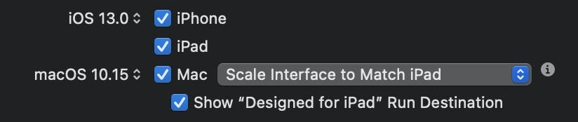

Over the Christmas period I had energy to finally explore Mac Catalyst. 

I'd taken a look around this time last year but found that a lot of libraries weren't compatible with Catalyst. A year later there is better (but still not great) support from library vendors, and I decided to take a look at it again.

Using my experimental app, *Books*, which is a clone of Goodreads, I dug in to making a Catalysed app.



## Getting set up

The easiest part of getting [set up for Catalyst](https://developer.apple.com/documentation/xcode/creating_a_mac_version_of_your_ipad_app) was the first time – checking the box to enable support. Xcode does its thing in the background and you have a perfectly working Mac app! 

Just kidding.  

  

I had to update Cocoapods and my pods first. At the time of writing I still had issues and had to wipe my `DerivedData/` folder to avoid an issue with RxSwift not compiling.

As all my libraries were thankfully compatible with Catalyst in this project, but, in other projects I attempted, I couldn't get further than this point. I found library frameworks needed signing on macOS – and every time I updated a pod it would revert this change needing me to go back and sign them again, so be aware of this.

Now I could build and run the app on my Mac! For this project, this took about half an hour. 

Thankfully I wasn't using any APIs that are unavailable on macOS, but again, on a more complex project I got stuck here. Some APIs are unavailable in Catalina with Catalyst that are available in Big Sur, which might also require fixing before you can build the app successfully.

I selected "Optimise interface for Mac", which changes the UI to act more Mac-like (this is only available in Big Sur). There wasn't much difference; the buttons and text size were the only noticeable changes.


## Quirks of the bars

I wanted to add more Mac-like behaviour to my app, which included replacing UINavigationBar with NSToolbar, and adding Touch Bar support. Apple have a guide [for Toolbars](https://developer.apple.com/tutorials/mac-catalyst/adding-a-toolbar) and [for the Touch Bar](https://developer.apple.com/tutorials/mac-catalyst/supporting-the-touch-bar), but get ready for a lot of `#if` directives.

I had hoped (and think it is a crazy missed opportunity from Apple) that these items would have similar, consistent APIs. Sadly they don't. I noticed the following differences:

- UINavigationBar requires `UINavigationBarItems` which are registered to the left or right sides of the `navigationItem`. They are scoped to the View Controller they're defined within.
- NSTouchBar is also scoped to the View Controller, but uses a delegate to create items (similar to dequeueing cells) from identifiers which you provide. To refresh a button on the Touch Bar, you must `nil` out the touchBar property and the View Controller will then recreate it.
- NSToolbar has a similar mechanism to NSTouchBar for registering and creating items, but is scoped to the Window, not the View Controller, and items must be added and removed manually.

Given that for my basic app I wanted these three items to stay roughly in sync I had to implement three separate APIs... which I found annoying. 

I built a class which I'm currently calling `Bartender`, to manage these three APIs and keep them in sync and with a single API. You can find it [on Github](https://github.com/amlcurran/Bartender/blob/main/Bartender.swift) and are welcome to use it. I will update it as I can.

## Going beyond Catalyst

With various other small tweaks I was happy with my Catalyst app at this stage. But one thing bugged me, in that I wanted the title bar to be transparent.

There is [an API for this](https://lukakerr.github.io/swift/nswindow-styles#11-transparent-toolbar-without-seperator) but it is available only to macOS AppKit apps, not Catalyst apps.

Interestingly, you can add `Bundles` to a Catalyst app, and these can use AppKit. Then you can load the classes from the bundle and call them directly from your app! 

It is outlined in a [post by Steve Troughton-Smith](https://www.highcaffeinecontent.com/blog/20190607-Beyond-the-Checkbox-with-Catalyst-and-AppKit) in great detail. I found their approach worked great, although having to use Obj-C and calling selectors via strings gave throwbacks to 2013:

```swift
func styleTitleBar() {
    let selector = NSSelectorFromString("styleTitlebar")
    interface.perform(selector)
}
```

## Conclusion

Making a current iOS app into Catalyst is valuable but isn't easy. I was lucky that this app had few dependencies and *very* simple logic but that won't apply to many apps looking to move to Catalyst. 

Two other projects I've attempted to make Catalyst compatible have required a couple of hours of commenting code out and updating libraries in order to get them working. 

The most frustrating part I found was that there wasn't an easy way to know which libraries support Catalyst or which APIs are unavailable until you build. You then fix that issue and then try to be presented with another. Rinse and repeat.

However, it is cool to see that I now have a codebase with a huge amount of consistent code and a macOS app for nearly-free. I don't get the impression that once you're over the first hump there will be much compatibility testing required (but building for macOS on your CI will make it clear if you're using iOS-only APIs).

I'd love to see whether Kotlin Multiplatform could integrate into this too, but for now, I'm happy!

