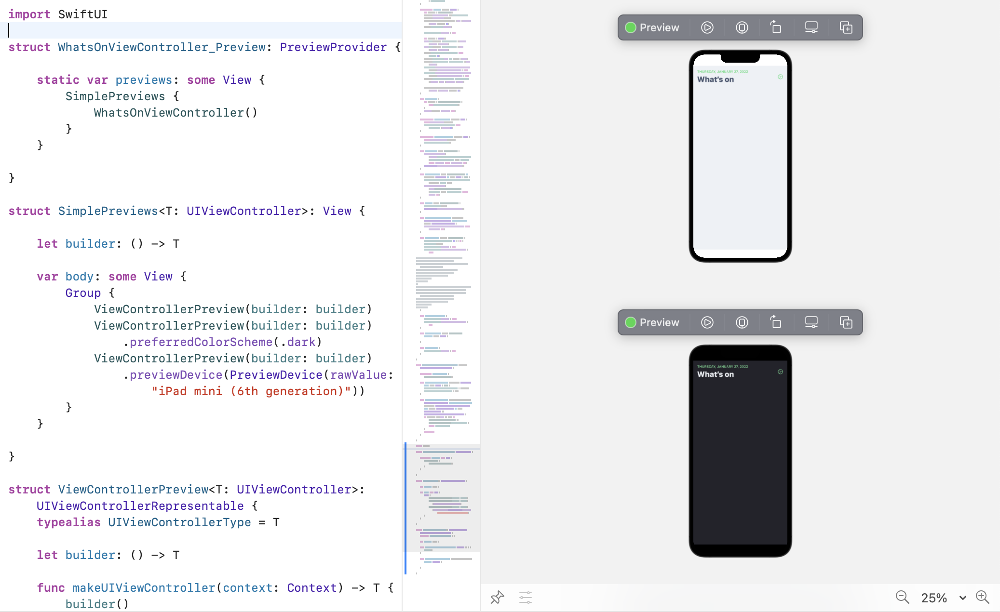

At Freetrade, we make a lot of use of SwiftUI's great preview system, despite not even using SwiftUI in production.*

Since using previews I've come to find a few tips which will speed up your SwiftUI preview journey.

## Preview UIKit views



First of all, SwiftUI previews are obviously great for SwiftUI, but did you know they also work amazing for UIKit too?

By using `UIViewRepresentable`, you can embed UIViewControllers and UIViews in SwiftUI, and this also means in previews too. We use a grouped preview to quickly make a decent-fidelity preview across light and dark modes, and iPad devices:

```swift
struct SimplePreviews<T: UIViewController>: View {
    
    let builder: () -> T
    
    var body: some View {
        Group {
            ViewControllerPreview(builder: builder)
            ViewControllerPreview(builder: builder)
                .preferredColorScheme(.dark)
            ViewControllerPreview(builder: builder)
                .previewDevice(PreviewDevice(rawValue: "iPad mini (6th generation)"))
        }
    }
    
}

struct ViewControllerPreview<T: UIViewController>: UIViewControllerRepresentable {
    typealias UIViewControllerType = T
    
    let builder: () -> T
    
    func makeUIViewController(context: Context) -> T {
        builder()
    }
    
    func updateUIViewController(_ uiViewController: T, context: Context) {
        
    }
    
}
```

## Running previews fast

Certain changes will cause the "Automatic preview updating paused" message to be shown. These changes mean Xcode needs to recompile in order to show the preview.

You want to avoid these as much as possible as these will take precious time away from your development lifecycle, interrupting your flow.

I've found purposely avoiding doing things that will trigger a need to recompile means I can develop faster.

The things that trigger recompilation include:

- Adding new properties to the class
- Adding a new interface to the class
- Overriding a method from the superclass

In essence, anything that changes the public API of your module will trigger a recompilation.

In order to make UIKit previews work quickly, you want to avoid these things. If I'm making a new UIViewController subclass for example, here's what I do:

- Create the class, with a preview
- Override the initialiser and `viewDidLoad()`
- **Here I click Resume on the preview**
- Now I develop the UI, trying only to add code inside the `viewDidLoad()` method. No recompilations needed!
- If I need to extract properties or override new functions, I make sure I do them all in one go, so I only need to recompile once.

## Conclusion

With a few small changes, you can make previews even if you use UIKit, helping you iterate your development faster. You now know how to use previews to avoid recompilations in order to keep your flow going.

Like this tip? Let me know on [Twitter](https://twitter.com/amlcurran)!

\* we can't yet use SwiftUI in production as we need to support iOS 11 & 12.