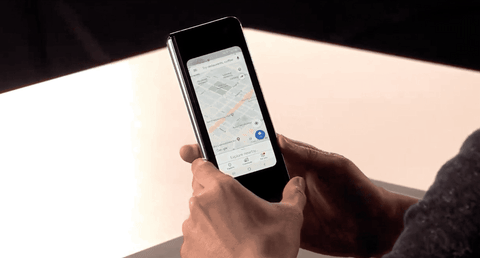
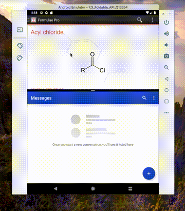

Foldable devices look to be the next big thing in mobile development. The next version of Android — Q — is bringing native support for them, meaning that as a developer, it gets even easier to support them. The latest version of the Android Q Beta gives us ways to try our apps on a foldable, and we've taken a look. Spoiler alert — if you've developed your app well already, it's likely to look great on a foldable too!

## What is a foldable?

Until very recently, device screens were, well, not foldable (although some got [unintentionally close](https://www.theverge.com/2019/1/5/18169606/apple-2018-ipad-pro-bending-statement-support-page)!). But with the introduction of the [Galaxy Fold](https://www.samsung.com/global/galaxy/galaxy-fold/), we seem to be coming into a new era of phones that can be flipped out into tablets.

The arms race for foldables is already underway, with Hauwei announcing their Galaxy Fold competitor, and even Apple filing patents for similar foldable iPhones.

So how as an Android developer or a CTO, can you prepare your product for foldables?

## Preparing your app for foldables

The good news is, if you are a well-meaning Android developer, you're probably most of the way there already!

A lot of the functionality for foldables is built upon what we've had since Android 1.0 — the configuration change. Just as rotating your phone from portrait to landscape is a configuration change, so is unfolding your foldable.

Therefore, when handling a configuration change, it is especially important to keep the **user's context and continuity**. Previously, we could as developers be a bit sneaky and just reload everything on configuration change, but this will be really annoying and disruptive to your foldable users!

There is many ways of dealing with keeping state across configuration changes, but naturally Google recommend their [ViewModel](https://developer.android.com/topic/libraries/architecture/viewmodel) pattern, from Android Jetpack. We're using this increasingly in our apps here at Novoda, and finding it a great help (especially as it interfaces with RxJava incredibly well). You can find out more about our adventures with ViewModels in our [spikes repo](https://github.com/novoda/android-demos/pull/41).

Supporting foldables isn't just about keeping the user where they are — but making sure they can get where they want to be. With the varied sizes of foldables it is increasingly important to make sure that your UI works not just on a portrait phone, but in 1:1 ratios, landscape, and also very small windows. For example — can the user scroll to get to where they need to be? Do elements overlap when using a small window? Are you assuming widths and heights of screens?

A good solution to a lot of this is a) [communication with your designers](https://blog.novoda.com/addconf-talk/), b) considering `ConstraintLayout` and c) ensuring all screens are scrollable at a minimum. This will allow you to be super flexible with your UI, and tackle all eventualities. The bonus here is that you'll end up supporting split-screen on phones, and also go a long way to supporting Chromebooks as well!

One big shame about the support right now is that, unlike the right-hand part of the GIF at the top of this post, there's no nice way of fluidly transitioning between folded and unfolded views right now. You could probably do something with handling configuration changes yourself via `onConfigurationChanged()` and animating layout changes but that brings a lot of other ways to go wrong! Let's see if Google change this in later versions of Q.

## Testing your app on a foldable

So, you're now using ViewModels to keep the user from getting frustrated, and you're pretty sure that your UI is going to look great on a foldable. But "pretty sure" isn't positive, and you don't have $2000 to shell out for a Galaxy Fold, so what now?

Luckily, as of Android Q Beta 2, there's an emulator which you can use to test your app's foldability. As of writing, you'll need the Canary version of Android Studio 3.5, and you can follow the instructions [here](https://developer.android.com/preview/get#on_emulator). It's not the most stable thing right now, but it is usable; and it is just as easy to deploy your app to it as any other emulator.

You can even see in this GIF that an app I've not updated in ~5 years works pretty well with a foldable (and doesn't suffer from misalignment like Messages does!).

## Will foldables change mobile?

Technology trends come and go, so how do we know that foldables will stick around? Simply put, we don't. There's no mention of it in the latest Gartner Hype Cycle, nor Thoughtworks' latest tech radar, so we're very much at the cusp of foldables emerging into the mainstream.

Much like the first touchscreen phones, foldables are definitely in the "bulky and expensive" part of their development (although the Hauwei one looks pretty stunning). In my opinion though, a foldable display seems like a great idea — I love the idea that I could text on a small screen but then fold it out to be a big screen to read or sketch on.

We'll see the technology evolve over this year — I'd be interested to see what a potential Galaxy Fold 2 would look like. I'm sure if Apple ever decide to do a foldable phone, then that would kick up enthusiasm in the field a lot more and bring foldables into the mainstream.

## Summing up
Foldables seem to be the Next Big Thing in mobile to avoid the stagnation of the current generation's slowing innovation of devices.

As a developer, it is pretty easy to support them, providing you're already doing the right things. Supporting them also gives you support for great experiences split-screen and Chromebooks as well.

As a CTO or project lead, there's not a huge amount to take advantage of for foldables right now, but by preparing you can get ahead of the market when (or if!) it explodes.

### Resources

- [Announcing support for foldables](https://android-developers.googleblog.com/2018/11/unfolding-right-now-at-androiddevsummit.html)
- [Getting your app ready for foldables](https://android-developers.googleblog.com/2018/11/get-your-app-ready-for-foldable-phones.html)
- [Handling configuration changes](https://developer.android.com/guide/topics/resources/runtime-changes)