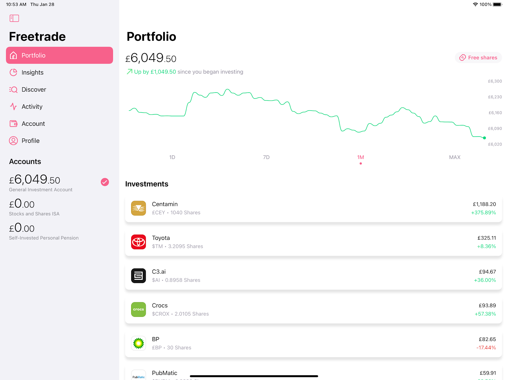
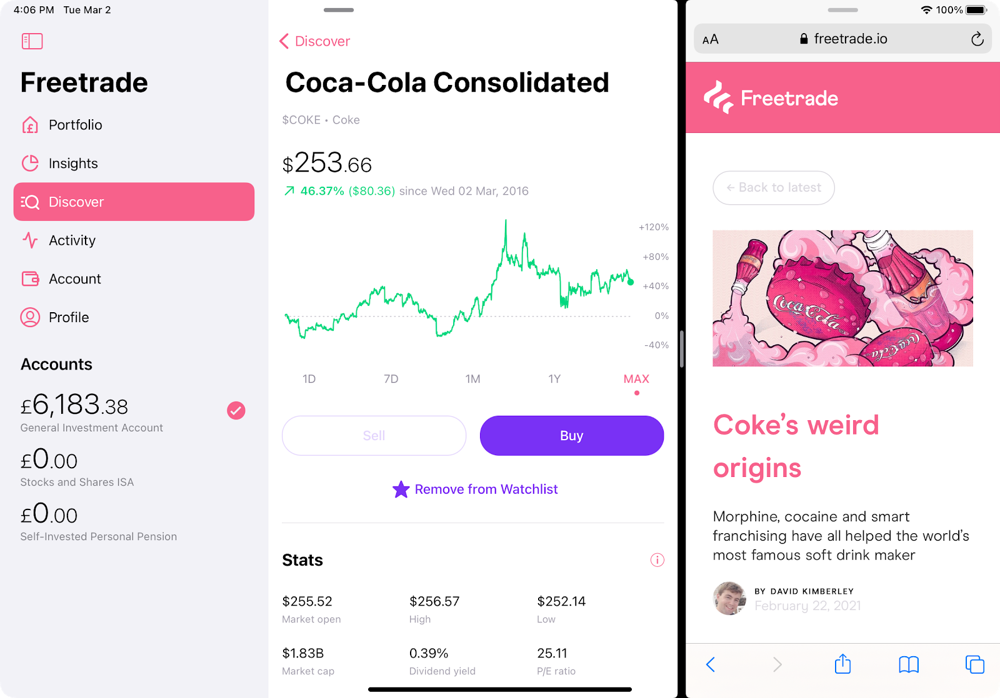

How we developed the app with a brand new UI.

Today, we're starting the rollout of the Freetrade app on iPad.

This has been a target of mine since I started at Freetrade and more importantly, since I bought an iPad.

If you open your latest Freetrade app version on iPad, you will see this:

Here are some of the things you can expect on Freetrade for iPad:

- A brand-new side bar, to select tabs, view your accounts, and switch between them more easily
- Bigger charts, making it even easier to browse price points
- You can now access your profile wherever you are in the app

Not only does this give a better use of the increased screen size, but it enables you to use Freetrade side-by-side with another app.

Fed up of having to switch between our app and Safari for your stock research?

Now you can run them side-by-side:

# Developing Freetrade for iPad

As you might notice, the app looks very similar on iPad compared to on iPhone.

This is very intentional, to give our customers a consistent experience, and reduce the amount of work for our developers.

While some companies make completely separate iPad apps with distinct UIs, our engineering team is still small (check out the latest engineering roles here if you want to help make it larger!) so our aim was to make the iPad as minimal a change as possible.

The rest of the development time was spent checking everything looked good on iPad, and working out how to roll this out – in fact, the majority of the code has been in the app for a few weeks now!

To ensure a smooth rollout, we’re releasing this in stages, in order to make it easier to figure out any problems and their causes easier:

- The code is all in the app but not turned on. This gives us the opportunity to make sure nothing regressed for current users.
- We release the app with the iPad support turned on. Users will see the left-hand UI which acts the same as the iPhone. This allows us to ensure there are no issues specific to the iPad.
- Then we turn on the new UI, allowing us to ensure there are no issues specific to the new UI.

We hope enjoy using Freetrade for iPad!
