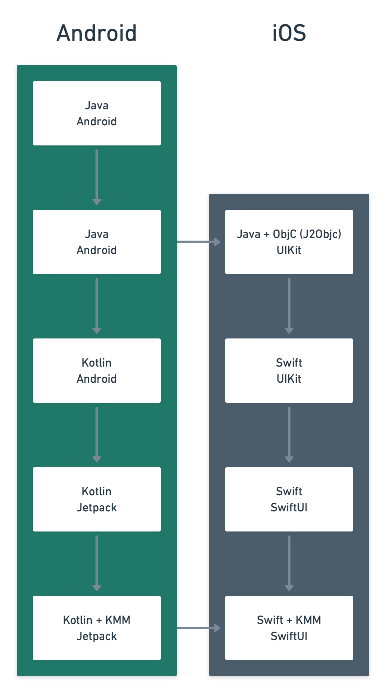

Over my career, I've had to learn a few frameworks, languages, and technologies. I've been asked a few times how I did it, and whilst there's no silver bullet, there's a set of rules I follow when trying to learn something new.

## Change one variable

One thing I try to do when learning a new framework or technology is to make a learning project. But importantly, I tend to make that project the same (or similar) to a previous project I've done before. 

In science there is the concept of independent variables. When you're running an experiment, you don't want two things to be changing at once. Having two variables makes it harder to know which one it making the effect you're seeing! 

This is the same principle here. By implementing *a task I've already solved* in a new environment, I can focus on the environment, not the task. 

My projects differ but one I keep coming back to is What's On. In the 7 years I've been working on it, it has gone through the following (large!) lifecycle:



It's important to make sure your test project is complex enough for you to get a decent amount of the environmental understanding. At a minimum I implement:

- A list view (allows you to understand lists)
- A detail view (allows you to understand navigation and more complicated UI)
- A third party integration (allows you to understand networking or a similar API)
- A nicety from the platform (e.g. widgets)
- Unit testing

## Understand the building blocks

The second part is more academic but helps a lot and that is learning how programming languages work. 

I don't think it is that important to know everything but understanding the basic constructs of code, and how they look in different languages will help. 

Instead of thinking in a way that is specific to a single language, a common way of thinking makes the similarities between languages fade into the background. This makes it then easier to notice, focus on, and ultimately learn the differences quicker.

For example, knowing what a class, property, or closure *is* will make it much easier to work in languages with similar constructs, even if they look different. 

For example, here's the same code in Kotlin, and Swift:

```kotlin
interface OurInterface {
    fun aFunction(aParameter: String): Boolean
}

class OurNewClass(
    val aProperty: String
) : OurInterface {

    override fun aFunction(aParameter: String): Boolean {
        return aParameter.all {
            it.isLetterOrDigit()
        }
    }

}
```

```swift
protocol OurInterface {
    func aFunction(with aParameter: String) -> Bool
}

class OurNewClass: OurInterface {
    
    let aProperty: String
    
    init(aProperty: String) {
        self.aProperty = aProperty
    }
    
    func aFunction(with aParameter: String) -> Bool {
        return aParameter.allSatisfy { character in
            character.isASCII
        }
    }
    
}
```

There's not much difference!

### Learning abstract tree syntax

There's a concept called Abstract Tree Syntax (AST) which is useful here. 

It is useful for meta-programming (programming code to read code) and understanding them helps learning the core of a programming language. ASTs are a fancy term for "the rules that a programming language has to follow". For example, a class can implement multiple interfaces, but can't override multiple subclasses. The AST for a class would look something like this:

```kotlin
interface KotlinClassAST {
    val subclass: KotlinClassAST?
    val implementedInterfaces: List<KotlinInterfaceAST>
}
```

If you want to get an understanding of the building blocks of a language, learning about its AST is a good start, and the best way to learn about ASTs is by implementing a lint rule! 

Both Android Lint and SwiftLint use ASTs to define their rules and they are a good place to look. You can read more about how I implemented lint rules in [this post](https://www.amlcurran.co.uk/articles/lint-rules).
