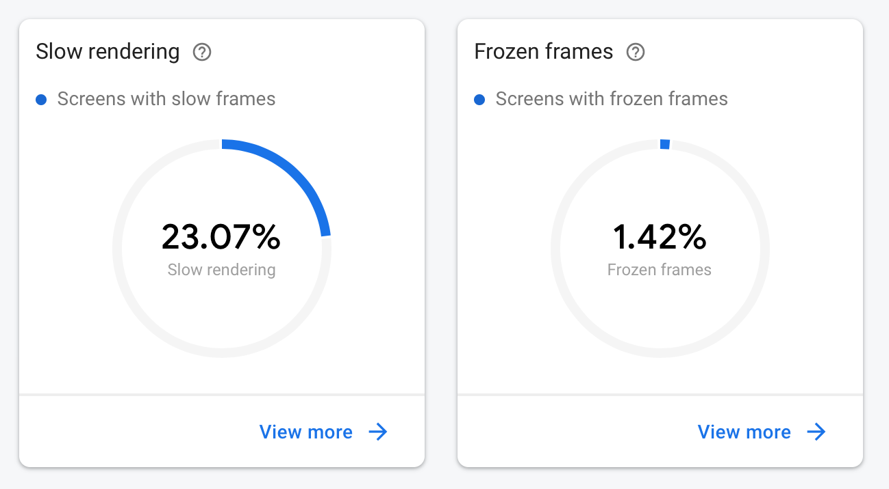
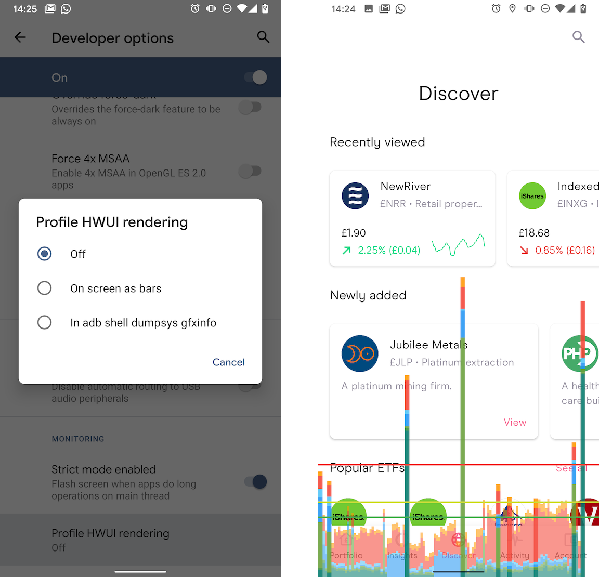
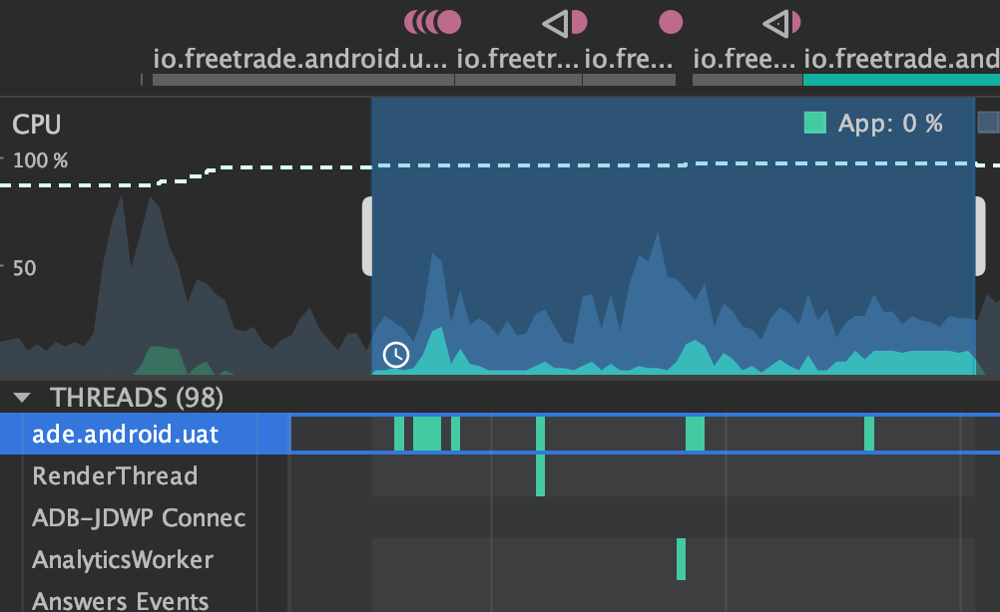
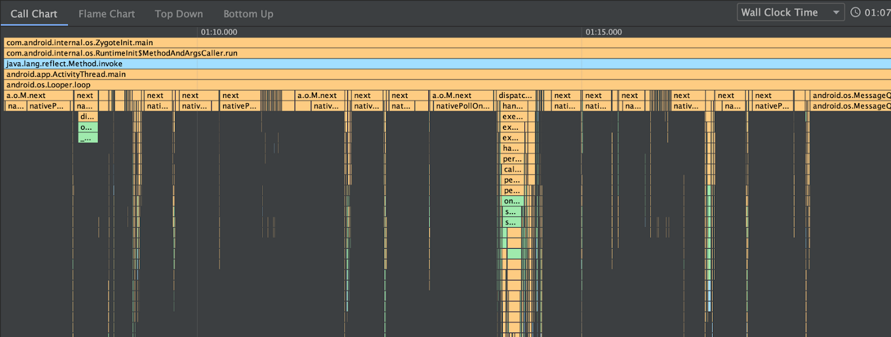
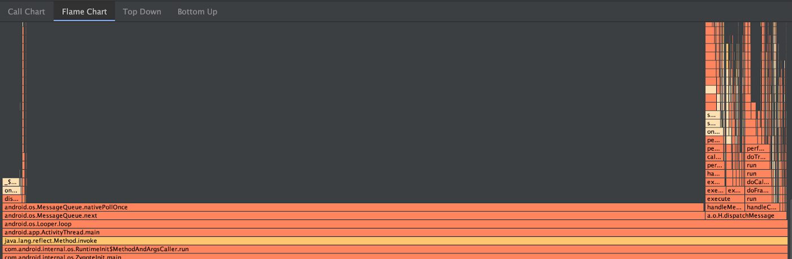
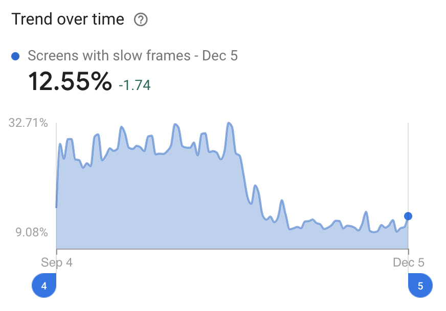

A few weeks ago, a Freetrade customer reported that the Android app was being slow.

I was on-call at the time and decided to have a dive into the performance of the app to make sure nothing unusual was going on. 👀

Performance profiling is a tricky subject at the best of times, so I figured an example workflow and process might be useful to those who want to improve the performance of their own apps.

## Firebase Performance
The first step I took was to look at the Firebase Performance dashboard - we're using this in the app to measure performance in the wild.

The Slow Rendering metric is a useful first stop. It shows the percentage of people who have more than 50% of their frames taking over 16ms. Android needs 60 fps for a smooth and fluid experience. This gives you 16 milliseconds to do work without missing a frame. If you want to set yourself a real challenge, a 90 fps display like the Pixel 4 gives you only 11ms per frame!

The app slowdowns were also happening on high-performing devices such as the Galaxy S10 - so the problem wasn't due to old hardware. Our next step was to pinpoint where exactly this was happening and how.

## Understanding jank in the UI with GPU rendering
There are many very useful things in the Developer Options on Android phones (follow [this process](https://developer.android.com/studio/debug/dev-options) to enable them).

One of my favourites is the GPU (or HWUI) rendering:

The green horizontal line on the overlay graph corresponds to 16ms - so every time you see a chart line go above this, that frame took over 16ms to render meaning (at least!) one frame would have been missed.

Unless your app is simple or very well optimised, you are unlikely to have a graph that is always under the 16ms line. But if your app is consistently over the line then you probably need to be more efficient.

## Using the CPU profiler to find bottlenecks
The GPU rendering is useful to find out when and how bad jank is, but not what it is causing it. To understand why our app was slow, I then used the CPU profiler in Android Studio.

There are four different profilers but the most useful one for us was the CPU Profiler. For our slow down problem, only the topmost one (the main or UI thread) was important.

Large chunks of work run on the main thread will result in jank because they cause a frame to be missed.

The chunks in the image above show we were doing some long-running work on the UI thread but it doesn't tell us what that work is. By profiling the CPU, you can actually find what methods are being called, and how much time each one is taking.

The Call Chart shows calls hierarchies - looking out for wide bars is what you want here. You can hover over any method call to see how long it took in total. In our case, nothing really stood out here, so we moved onto the second chart type:

The Flame Chart above is sometimes more useful because it will group together similar method calls. So if you have a method that isn't too slow, but many frequent calls to it, this will be a lot more apparent in the flame chart.

> Note both of these charts show the profile after optimisation. The absolute timing of methods is not totally accurate, because profiling will slow the app down. But you can rely on the relative timing between methods.

This is where we found our performance issue. We were loading a JSON file from disk, which was slow - but not slow enough to be obvious on the Call Chart. However, we were invoking this 5–10 times when you changed tab on the app. This added up to around 200ms pause on even a fast device!

Not only was the file being loaded on the UI thread, it was also being loaded multiple times.

We're using Dagger to manage our dependencies so - given it is a file we know is never going to change - we made it a singleton so the file was only loaded once.

Did it work? Well, we released this change a month ago, and the app performance has improved significantly since then:

I was surprised to see such a simple change (a 4-line pull request) make such a large impact!

## Summing up
We have over 80,000 users here at Freetrade, and ensuring their experience is good doesn't just boil down to nice animations and loads of features - performance issues downgrade a great user experience to just an OK one.

Some issues are hard to find but a systematic search is better than just giving up. By validating the high-level problem and digging down you can find the solution. Different tools give you different levels of understanding of the problem:
- **Firebase Performance** shows you if there is an issue at all
- **GPU rendering charts** show you at what points the issues are occurring
- **CPU profiling** shows you exactly what code is being slow

We're certainly not done fixing performance problems, so keep your eyes peeled for an even faster app across our next releases.

And if you fancy joining the Freetrade team to work on these sorts of problems then check out our careers page. We're on a hiring spree and need the best engineers out there to develop our next generation investment platform!

## Very quick tips for a performant app
Here's some super-quick tips for a performant app:
- Keep your UI hierarchies flat and avoid nesting complex layouts too deeply (including `ConstraintLayout`!)
- Be very sure heavy disk access or even JSON deserialising is done off of the main thread
- If pieces of data are never changed, consider how you can make them initialise only once
- Don't optimise something until you know it is a genuine user problem.

## Some good resources
- [Analyse with Profile GPU Rendering](https://developer.android.com/topic/performance/rendering/profile-gpu?hl=enaa)
- [Inspect CPU activity with CPU Profiler](https://developer.android.com/topic/performance/rendering/profile-gpu?hl=enaa)
