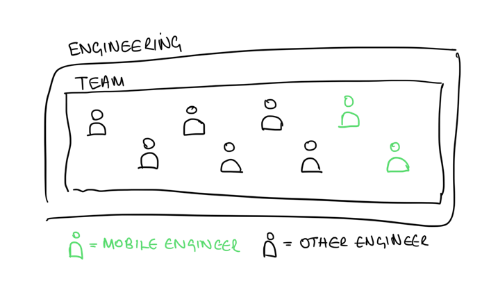
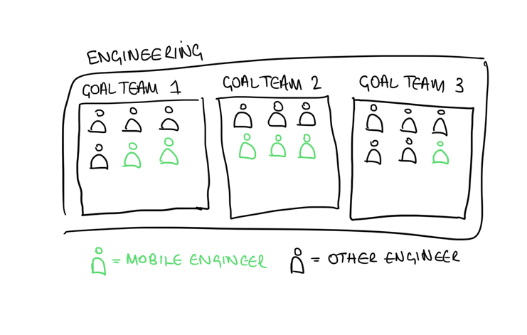
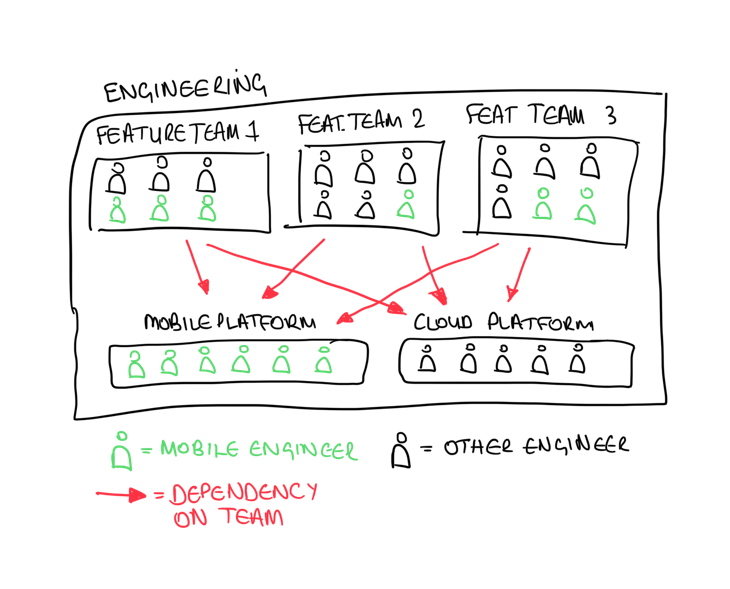
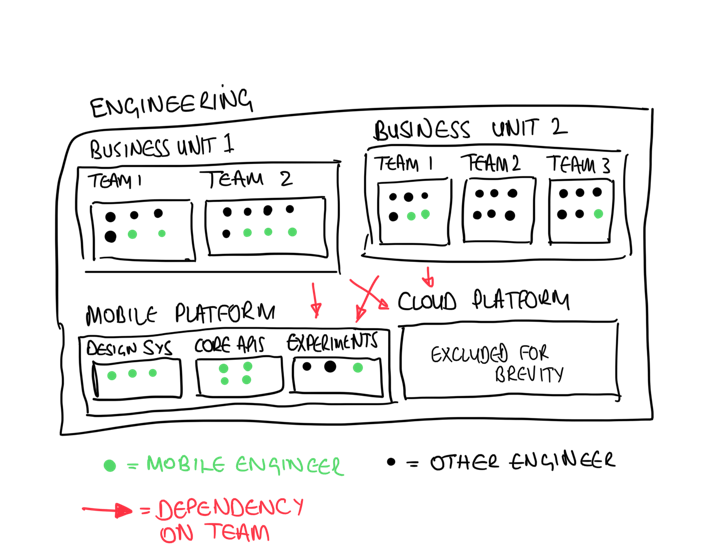

As companies gr ow, so does their teams, technical debt, and requirements. Scaling is a notoriously difficult problem for any part of engineering, but mobile – with its monolithic codebases and slow release schedule – presents unique difficulties.

Over the years in mobile development, I've worked at many different scales and companies, and here is my "golden path" for scaling mobile capabilities. This isn't an immutable formula I follow every time, but the basis of a strategy to be extended and tweaked as the problem requires.

This plan covers team structure, code structure, and personnel requirements. 

## Table of contents

```toc
```

## A structure for bootstraps
> Best used when the company has 1-10 engineers



Congrats you've made a business! Here everyone is in one team and you have full stack engineers doing everything. 

There's no point having much mobile team structure at this point but, like a house, the foundations you build here will have big implications on the rest of your engineering department's expansion. 

### Project structure

Any modularisation or semi-decent structuring of your app here will help when you grow - but don't go overboard. Spending a lot of time structuring your project to what you think the company might look like in future is futile.

Aim to get 5 modules *maximum* in your project. These days, I'd always try to start a project with the following: 

- A designsystem module
- A core module (the seed for your mobile platform team, including networking, auth)
- An app module where everything else sits
- *Maybe* one or two feature modules if you have a lot of confidence about what your features will be. If not, put it all in the app module.

### Focus areas

- Not over-engineering a complex system
- Avoiding a monolith that will later be unchangeable

## A structure for start-ups

> Best used when the company has 10-30 engineers



Now your company is growing, and you no longer have one engineering team doing everything. You're likely at the point you have two or three teams focused on business goals, for example Acquisition, Retention, or Growth. 

At this point your mobile function is larger and split between teams. Cross-cutting concerns are dealt with in product teams which means they're easily deprioritised. Conversations get harder and teams can form silos without good communication. At this stage, focusing on cross-team structures and management is important.

Get your mobile engineers together every couple of weeks to discuss issues, run katas, or chat about new tech. They should be evaluating technical debt together or cross-cutting concerns (e.g. design system development) and giving their EMs that information to schedule that work.

One thing to consider at this scale is how you use your best engineers (Staff & Principle levels). It's unlikely they'll be spread across teams, but giving them a degree of freedom to help out the other teams with more complex problems will lift the quality of the app. 

### Project structure

The app structure should be modularised here but not extensively. Start pulling out a few feature modules which would give the teams in the next section defined boundaries to work in. Here using [Reverse Conway's Law](https://martinfowler.com/bliki/ConwaysLaw.html) will help. 

There should be a "core" module containing core APIs (e.g. networking) and UI utilities (including the design system) whose responsibility will eventually fall into the mobile platform team in the next team expansion.

### Benefits

- Each team owns their own goals and how they achieve that in mobile.
- Maintenance work is shared across teams meaning none is pinned down with BAU.

### Focus areas

- Specialist engineers might be "stuck" in teams (e.g. a UI specialist might be in the Retention team when you could use them in the Growth team).
- EMs need to be understanding that tech debt will be shared across teams – including their own.
- Laying foundations of feature modularisation now will prove hugely beneficial in the next team expansion.

## A structure for scale-ups
> Best used when the company has 30-80 engineers



You've expanded again and your company has roughly 8 teams. 

Business goals are too broad here and you've split into feature teams, for example Onboarding, Profile, and Recipes. You may still have a Growth team who are working on getting users into the app. 

At this point you should bud out a Mobile Platform Team. Coordinating technical debt and cross-cutting concerns across 8 teams is inefficient. 

Your Mobile Platform Team's responsibility is to accelerate the development of the feature teams. The feature teams shouldn't be bogged down by BAU and building the APIs they need. 

Mobile Platform is a broad brief but the team's stakeholders are the _other_ teams. A few things that come to mind that this team should focus on are:

- Core APIs, e.g. networking, analytics, A/B testing
- Architectural blueprints/templates
- Strong design system (in collaboration with Product & Design)
- Devops, releases, and mobile observability

Building observability and the ability for experimentation are two useful things to develop at this point. 

### Benefits

- Feature teams don't have to deal with BAU
- Centralised ownership of mobile app avoids "not my problem" 

### Focus areas

- The platform team needs to run ahead of feature teams, but this isn't always easy in a fast-paced environment
- The platform team needs strong stakeholder management
- Tech debt here is difficult to handle 

## A structure for larger companies

> Best used when the company has 80+ engineers



At a large company with many engineers, there's a lot of teams. Like in the scale-up phase, where communication between engineers gets harder, at this level, communication between entire teams and business units is hard. 

Feature teams are now very specialised, and teams may even own and develop single screens in the app. 

The platform team has a broad brief at the scale-up phase, but now it's time to split those briefs into separate teams, and promote mobile platform to a business unit. Make a team which owns the design system, one which owns core APIs, maybe even a whole team for mobile devops and observability.

Fixing technical debt here becomes easier as the platform teams have less pressure to jump ahead of the feature teams. Focusing on automation and testing in scale-up size will make technical debt much less risky to fix. 

By now the mobile architecture is probably unlikely to change without significant investment. Code templates and education for the feature teams will help them be as productive as they can. There should be less copy and pasting of code at this point and clear expectations of "good code" in the mobile app.


Do most engineering departments need to get to this size? I'm not convinced. A whole team for a design system for example seems to me like it would run out of work pretty quickly. 

### Project structure

Modules are now highly specialised and there are multiple modules for utilities such as the design system, networking, analytics etc.

Feature teams at this point may choose to pull their modules out into separate dependencies which are integrated into the main app. There's advantages and disadvantages to that – teams are more protected from others' work but integration into the main app becomes slower and harder.

The dependency tree in the app between modules will likely be pretty complex at this point. Having some dependency visualiser will be of use. 

### Focus areas

- Avoiding multiple teams unrelatedly building similar things without knowing 
- Complexity has shifted from code to the build system – keep an eye on it. 

## Conclusion

I see the expansion of a mobile engineering function as one of the most interesting problems in my career. 

At each stage, the complexity and focus areas of the management shifts:

- At bootstraps, the focus is code & delivery
- At startups, the focus becomes people & communication
- At scale-ups, the focus becomes structure & maintainability
- At corporations, the focus becomes teams & consistency 

That paints a simplistic picture. No company will ever "breeze" from one scale to another, having fixed all the problems of the previous scale, and instantly receive a new set of challenges. 

The difficulties of earlier scales will drag into the later scales. This is the biggest danger of hypergrowth I see – you don't get enough time to solve the startup challenges before you're suddenly a scale up. And by the time you're a scale-up, the startup problems have a much bigger impact. 

Ultimately though, everything boils down to communication. And everything is a trade-off. 

| Size        | Focus                       | Engineering department structure | 
|-------------|-----------------------------|----------------------------------|
| Bootstrap   | Code & delivery             | Single team                      |
| Startup     | People & communication      | Goal teams                       |
| Scale-up    | Structure & maintainability | Feature teams + platform team    |
| Corporation | Teams & consistency         | Feature teams & utility teams    |

_Cover photo from [Markus Spiske](https://unsplash.com/photos/vrbZVyX2k4I) on Unsplash_
