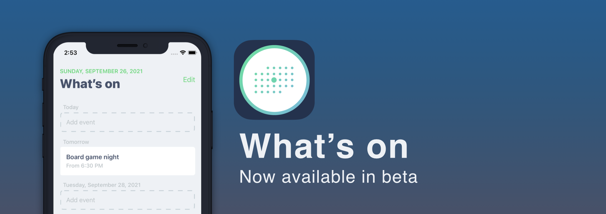
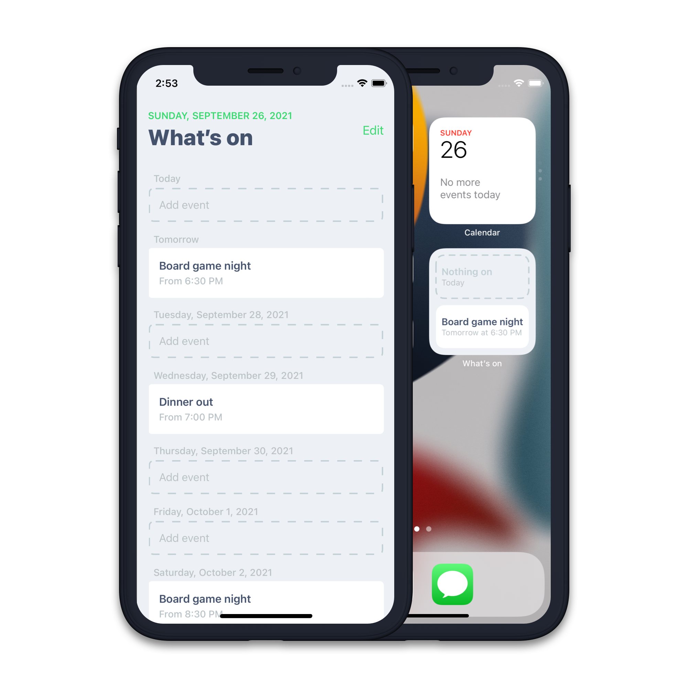

As of today, What's on is available in beta [on Testflight](https://testflight.apple.com/join/cikdBFDI).

What's on is a pet project of mine, which provides a glanceable look at the next two weeks of your calendar.

Many of us use calendars to organise our lives, but they surface a lot of information and are overwhelming.

What's on reduces your time down to the essential question – **Am I busy this day or not?**.

You can use What's on for any time slot you want. I use it to show what I have on each evening so I can plan accordingly. It also has a home screen widget about your next two days.

Stay tuned for more features coming soon, and feel free to get in contact with feedback.

If you want to sign up for the beta you can do so on [Testflight](https://testflight.apple.com/join/cikdBFDI) on iOS, iPad OS and macOS (Apple Sillicon).

A post about the development of What's on will be coming shortly on this website. 